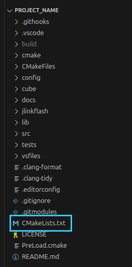
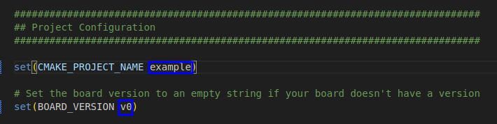

---

# Índice

- [Índice](#Índice)
- [Introdução](#introdução)
- [Requisitos](#requisitos)
  - [STM32 Cube MX](#stm32-cube-mx)
    - [Instalação no Windows](#instalação-no-windows)
    - [Instalação no Linux](#instalação-no-linux)
  - [WSL](#wsl)
  - [Compiladores](#compiladores)
    - [Instalação WSL e Linux](#instalação-wsl-e-linux)
  - [Git](#git)
    - [Instalação WSL e Linux](#instalação-wsl-e-linux-1)
  - [Visual Studio Code](#visual-studio-code)
  - [STM32 Cube Programmer](#stm32-cube-programmer)
- [STM32 Project Template](#stm32-project-template)
- [Cube MX](#cube-mx)
- [Estrutura de Código](#estrutura-de-código)
- [HAL](#hal)
- [GPIO](#gpio)
- [ADC e DMA](#adc-e-dma)
- [UART e DMA](#uart-e-dma)
  - [Recebendo dados](#recebendo-dados)
    - [Pacote de 1 byte](#pacote-de-1-byte)
    - [Pacote de mais de 1 byte](#pacote-de-mais-de-1-byte)
    - [Transmitindo dados](#transmitindo-dados)
- [Interrupções](#interrupções)
  - [NVIC](#nvic)
  - [Interrupções externas](#interrupções-externas)
- [Timers](#timers)
- [PWM](#pwm)
  - [Geração de PWM limitada](#geração-de-pwm-limitada-(para-servos-e-ESCs))
  - [Leitura de PWM](#leitura-de-pwm)
- [I²C](#ic)
- [STM Studio](#stm-studio)
  - [Leitura de variáveis](#leitura-de-variáveis)
  - [Escrita de variáveis](#escrita-de-variáveis)
  - [Extras](#extras)
- [CMake e Makefile](#cmake-e-makefile)
  - [Make/Makefile](#makemakefile)
  - [CMake](#cmake)
  - [Instalando CMake no Linux](#instalando-cmake-no-linux)
  - [Configuração inicial do CMake](#configuração-inicial-do-cmake)
  - [Compilando e executando o projeto](#compilando-e-executando-o-projeto)
- [Apêndices](#apêndices)
  - [Colocando caminhos no PATH](#colocando-caminhos-no-path)
    - [O que é PATH](#o-que-é-path)
    - [Windows](#windows)
    - [Linux](#linux)
  - [Instalando MSYS2 no Windows](#instalando-msys2-no-windows)
  - [Virtualização da BIOS](#habilitando-a-virtualização-na-bios)
---

# Introdução

Este documento tem como objetivo explicar como é feita a programação de
microcontroladores da STMicroelectronics, voltado especialmente para os robôs da
equipe ThundeRatz que usam placas com esses microcontroladores.

Nas próximas páginas serão apresentados os softwares necessários para isso, e
uma explicação de como programar algumas das principais funcionalidades desses
microcontroladores.

# Requisitos

Para poder escrever programas para os microcontroladores da ST é necessário
baixar alguns softwares e bibliotecas específicas, bem como um editor de texto.

## STM32 Cube MX

Esse software é bem importante quando se está no começo do desenvolvimento e é
utilizado desde o projeto de placa. Nele, é possível setar várias configurações
de pinos e periféricos por meio de uma interface gráfica e gerar o código disso
automaticamente, o que seria muito difícil de fazer na mão.

Para baixá-lo, acesse [este
link](http://www.st.com/en/development-tools/stm32cubemx.html).

Instruções gerais de uso se encontram logo na próxima seção. Instruções
específicas estarão em suas respectivas seções.

### Instalação no Windows

Clique em "Get Software" e baixe a última versão disponível em "Get Latest".

Antes de poder baixar o software é necessário estar logado em uma conta da ST. Caso não tenha, crie uma antes de continuar.

Extraia o .zip e execute o arquivo SetupSTM32CubeMX-X.X.X.exe (X.X.X é a versão).

Seguindo as instruções da tela, copie o caminho em que o CubeMX será instalado, isso vai ser importante para configurar o `CUBE_PATH` no WSL.


Para poder usar o CubeMX no WSL, precisamos configurar o `CUBE_PATH` dentro dele. Para isso, execute o seguinte comando no terminal do Ubuntu:

```bash
 code ~/.bashrc
```

No arquivo que abrir, coloque a seguinte linha no final do arquivo:

```bash
 export CUBE_PATH="/mnt/c/'caminho que voce copiou na instalação do cubemx"
```

Complete o comando com o caminho que você copiou anteriormente, lembrando de retirar `C:\` do caminho copiado e colocar todo o comando com barras inclinadas para a direita `/`.


Em seguida, volte no terminal do Ubuntu e dê o seguinte comando 

```bash
 source ~/.bashrc
```

Para verificar se o `CUBE_PATH` foi configurado, execute o seguinte comando:

```bash
 echo $CUBE_PATH
```

Se tudo deu certo, o caminho do `CUBE_PATH` vai ser mostrado. No nosso exemplo retornaria:

`/mnt/c/Program Files/STMicroelectronics/STM32Cube/STM32CubeMX`

### Instalação no Linux

É necessário instalar Java. Para isso, execute os seguintes comandos:

```bash
$ sudo add-apt-repository ppa:linuxuprising/java
$ sudo apt update
$ sudo apt install oracle-java10-installer
```

Agora, execute o arquivo SetupSTM32CubeMX-X.X.X.linux. Substitua X.X.X pela
versão baixada.

```bash
$ sudo ./SetupSTM32CubeMX-X.X.X.linux
```

Siga as instruções na tela.

É possível que ocorra alguns erros porque o Cube depende de bibliotecas de
sistemas de 32 bits. Instale a biblioteca libc6-i386 para resolver o problema:

```bash
$ sudo apt install libc6-i386
```

Tente executar o arquivo novamente.

Após a instalação, crie uma variável chamada CUBE_PATH com o local de instalação
do Cube nas configurações da shell que você utiliza. Na pasta deve conter o
executável STM32CubeMX. O procedimento é similar a adicionar diretórios no PATH
[(Apêndice 2)](#colocando-caminhos-no-path), mas com o nome da variável
diferente e sem adicionar ao valor anterior da variável.

O local de instalação padrão é
`/usr/local/STMicroelectronics/STM32Cube/STM32CubeMX`.

Muito bem! O Cube foi instalado com sucesso. Porém, ao olhar no menu de
programas, pode-se perceber que ele não aparece em lugar nenhum. Para isso, é
necessário criar uma entrada para ele dentro do menu. Faça isso com:

```bash
$ cd /usr/share/applications
$ sudo gedit stm32cubemx.desktop
```

Dentro do arquivo em branco criado, digite:

```conf
[Desktop Entry]
Name=STM32 Cube MX
GenericName=STM32 Cube MX
Comment=STM32 Cube initialization code generator
Exec=/seu/local/de/instalacao/STM32CubeMX
Icon=/seu/local/de/instalacao/help/STM32CubeMX.ico
Terminal=false
Type=Application
Categories=Development;Electronics;
```

## WSL
WSL (Windows Subsystem for Linux) é uma funcionalidade do Windows que permite a execução de aplicativos e comandos do Linux Ubuntu diretamente no terminal do Windows. Então se você está no Windows, vai precisar.

### Instalação (somente Windows)
0. Primeiro, verifique se a virtualização da sua máquina está habilitada. Clique [aqui](#Habilitando-a-virtualização-na-BIOS) para ver o passo a passo.

1. Com o passo anterior concluido, vamos ativar o WSL. Vá em:

painel de controle -> programas -> ativar ou desativar recursos do Windows
Essa janela que queremos:


Habilite estas 3 opções:
- [X] Plataforma de máquina virtual
- [X] Plataforma do hipervisor do Windows
- [X] Subsistema do Windows para Linux

Reinicie seu computador.

2. Depois de reiniciado, abra o PowerShell como Administrador, insira o comando e aguarde a instalação:
    
```powershell
wsl --install -d Ubuntu
```
    
3. Agora com o Ubuntu (nossa distribuição de sistema Linux) instalado, feche o Powershell e abra o Ubuntu pesquisando-o no menu Iniciar. Um terminal abrirá e pedirá para você criar um nome de usuário e senha para o ambiente Linux.

4. Agora atualize os pacotes do sistema:
    
```bash
$ sudo apt update && sudo apt upgrade -y
```

Beleza, WSL instalado. 
   
>[Referência](https://learn.microsoft.com/pt-br/windows/wsl/install#prerequisites)


## Compiladores
### Make, CMake e arm-none-eabi-gcc 
**arm-none-eabi-gcc** é usado para compilar programas para microcontroladores em ambientes de baixo nível, como no desenvolvimento de firmware para dispositivos embarcados com o STM32.

**Make** é usado para automatizar o processo de compilação e construção de projetos de software. 

**CMake** é uma ferramenta de automação de construção, semelhante ao make, mas com maior flexibilidade e modernidade.

### Instalação WSL e Linux

>[!Warning] 
>Se você está no Windows e ainda não instalou o WSL, clique [aqui](#wsl).

Abra o terminal do Ubuntu e insira o comando:
```
sudo apt install -y cmake make gcc-arm-none-eabi
```
Depois de concluido, você pode verificar a versão de cada compilador para certificar que tudo ocorreu bem:
```bash
cmake --version
```
```bash
make --version
```
```bash
arm-none-eabi-gcc --version
```
Deve estar parecido com a imagem a seguir.


## Git

Git é um sistema de controle de versão distribuído. Ele serve para rastrear alterações em arquivos, especialmente em projetos de desenvolvimento de software, permitindo que várias pessoas trabalhem simultaneamente sem perder histórico.

### Instalação WSL e Linux

>[!Warning] 
>Se você está no Windows e ainda não instalou o WSL, clique [aqui](#wsl).

Abra o terminal do Ubuntu e insira o comando:

```bash
sudo apt install git 
```

Para certificar que o git foi instalado corretamente, verifique a versão:

```bash
git --version
```

## Visual Studio Code

Para baixar, acesse [esse link](https://code.visualstudio.com/).


## STM32 Cube Programmer

O STM32CubeProgrammer é uma ferramenta para programar os microcontroladores
STM32. É possível ver e apagar o conteúdo da memória flash, além de escrever os
arquivos binários. Para baixar, acesse [esse
link](https://www.st.com/en/development-tools/stm32cubeprog.html).

### Instalação no Windows

Clique em "Get Software" e baixe a ultima versão do Cube Programmer. Note que há duas opções de instalação para Windows, selecione a opção "Win64".

Extraia o executável da pasta zip baixada e execute-o.

Em uma das etapas da instalação, vai ser configurado o caminho que o Cube Programmer será instalado. Copie esse caminho, que mais tarde vai ser necessário para configurá-lo no Ubuntu.


Selecionando as opções padrão de instalação, aceitando os termos e instalando os drivers necessários para o Cube Programmer funcionar, podemos configurá-lo no Ubuntu.

Para isso, no terminal do Ubuntu, digite o seguinte comando:

```bash
 code ~/.bashrc 
```
 
No arquivo que abrir, coloque a seguinte linha no final desse arquivo:

```bash
 export PATH=$PATH:"/mnt/c/'caminho que voce copiou na instalação do cubeprogrammer'
```

Complete o comando com o caminho que você copiou na etapa anterior, retirando o `C:/` e colocando no final do caminho `/bin`. É importante verificar também se o caminho está com todas as barras que dividem as pastas inclinadas para a direita `/`.

Abaixo temos um exemplo de como ficaria:


Após isso, no terminal do Ubuntu digite 

```bash
 source ~/.bashrc
``` 

E para verificar se o CubeProgrammer foi configurado, execute o seguinte comando: 

```bash
 STM32_Programmer_CLI.exe -l
```

Algo parecido deve aparecer:

```bash
 -------------------------------------------------------------------
                        STM32CubeProgrammer v2.2.1
 -------------------------------------------------------------------

STM32CubeProgrammer version: 2.2.1
```

### Instalação no Linux

Para baixar, acesse [esse link](https://www.st.com/en/development-tools/stm32cubeprog.html).

Após baixar e instalar, adicione o caminho do executável à variável PATH
[(Apêndice 2)](#colocando-caminhos-no-path).

# STM32 Project Template

Vamos utilizar o template disponível [nesse
repositório](https://github.com/ThundeRatz/STM32ProjectTemplate).

O README nesse repositório explica bem como utilizar, mas explicaremos um pouco
nesse documento também.

A estrutura de pastas no template é a seguinte:

```
├── cube
│   └── stm32_project_template.ioc
├── inc
│   └── mcu.h
├── LICENSE
├── Makefile
├── README.md
├── src
│   ├── main.c
│   └── mcu.c
└── uncrustify.cfg
```

Na pasta cube, ficará o projeto do Cube e os arquivos gerados ao gerar o código.
Na pasta `inc` ficam os headers (arquivos .h) e na pasta `src`, os arquivos .c.
A forma de utilizar o Cube para esse template será explicada na próxima seção.

Para gerar o código, utilizamos o comando `make cube`. Depois disso, utilizamos
o comando `make prepare` para apagar os arquivos  do Cube desnecessários.

No caso de estar pegando o código em um repositório que já utiliza esse
template, precisamos, logo após o checkout ou o pull, executar os comandos `make
cube` para gerar os arquivos a partir do `.ioc` e em seguida `make prepare`.
Isso porque os arquivos gerados pelo Cube não vão para o repositório.

Os comandos do Makefile estão bem documentados no README. Mencionaremos aqui
alguns mais fundamentais:

* `make`: compila o programa, gerando os arquivos .elf, .bin e .hex.
* `make cube`: gera o código a partir do projeto .ioc do Cube.
* `make prepare`: apaga os arquivos desnecessários do Cube.
* `make flash` ou `make load`: grava o programa no microcontrolador.
* `make clean_cube`: apaga os arquivos gerados pelo Cube.
* `make clean`: apaga os arquivos objeto personalizados (não gerados pelo Cube).
* `make clean_all`: apaga todos os arquivos objeto (inclusive os gerados pelo
  Cube).

# Cube MX

Ao abrir o Cube, verá essa tela:


Para criar um novo projeto, escolha “New Project”. Ao fazer isso, verá essa
tela:


Aqui você pode digitar o nome do microcontrolador usado na placa para qual você
estará programando, nesse documento, será usado o STM32F303C6. Basta clicar duas
vezes no nome que aparece na lista inferior para selecionar.


Após selecionado, a seguinte tela aparecerá:


Como pode ser visto, na parte superior existem alguns menus e 4 abas, a aba
Pinout & Configuration será mostrada aos poucos ao longo do documento, a aba
Clock Configuration configura a árvore de clocks, a aba Project Manager
configura o projeto e a aba Tools possui uma ferramenta de simular consumo de
energia, que não costumamos usar na equipe.

A aba Clock Configuration normalmente é alterada apenas uma vez no projeto para
alterar a frequência do clock:


Nessa tela, apenas mudamos o clock nesse quadrado que está em destaque, não faz
muita diferença, mas costumamos deixar no máximo possível, para isso, basta
digitar o valor “max” que tem logo abaixo, sem um clock externo, é bem provável
que ele não possa ser alcançado, mas o programa vai dar uns avisos e colocar no
máximo possível real, basta aceitar (nesse caso, 64 MHz).

Na aba Pinout & Configuration, precisamos setar os pinos de gravação. Para isso,
na parte esquerda, localize o periférico SYS (na seção System Core) e, em Serial
Wire, selecione Debug Serial Wire.

Com isso, os pinos de gravação ficarão com a cor verde. Pinos com a cor verde no
pinout indicam que as configurações mínimas necessárias para utilizar o pino
fora completadas.

Após isso, já é possível gerar o código pela primeira vez, mesmo que vazio,
primeiro, vá nas configurações, na aba Project Manager.

Ao clicar nessa aba, a seguinte tela aparecerá, raramente será necessário mexer
nela novamente:


Na seção Project, coloque um nome para o projeto, cheque a opção "Do not
generate the main()" e mude o Toolchain para Makefile, o template usado pela
equipe está configurado para essa estrutura de código.


Então clique na seção Code Generator:


Marque a opção "Copy only the necessary library files" e a opção de gerar
arquivos .c/.h separados para cada periférico.

Após isso seu projeto estará configurado, agora, é possível gerar o código
clicando no botão "Generate code" na parte superior:


**Observação**: gere o código em algum lugar e copie apenas o arquivo
<nome_do_projeto>.ioc para a pasta cube do template.

# Estrutura de Código

Ao gerar o código pelo Cube, vários arquivos e pastas serão criados:


Não mexa nos arquivos gerados.

# HAL

A HAL (Hardware Abstraction Layer) é uma biblioteca feita pela ST composta por
várias funções que ajudam na manipulação dos periféricos e pinos, é possível ver
os arquivos dela na pasta Drivers, o Cube apenas copia para a pasta do seu
projeto o que estiver sendo utilizado nele.

Uma característica das funções é que todas elas começam com `HAL_`, e a
`HAL_Init()` está presente em todos os programas, inclusive nesse vazio criado
na seção anterior.

Mais exemplos serão dados nas seções seguintes.

# GPIO

A configuração de pinos como GPIO é a mais simples, já que raramente requer
ajustes extras, além de que praticamente todos os pinos podem ser configurados
como GPIO (input ou output). Para selecionar a função de um pino, basta clicar
nele na primeira tela do Cube e na função desejada (serve para todas as
funções):


Para a maioria dos usos de GPIO, apenas selecionar a função nessa lista é
suficiente, após gerar o código novamente, é possível ver as mudanças nos
arquivos, um arquivo gpio.c (e .h) foi criado, com apenas uma função de
inicialização de GPIO – `MX_GPIO_Init()`. Essa função precisa ser chamada no
início da main ou em alguma função de inicialização.

Será possível perceber um padrão a partir de agora na parte de configurações,
para praticamente todos os periféricos, toda configuração feita no Cube é
convertida em uma função `MX_<>_Init()`, que precisa ser chamada no início do
programa.

As funções para manipulação das GPIO estão no arquivo `stm32f3xx_hal_gpio.c` na
pasta Drivers, as principais são:

```c
File: stm32f3xx_hal_gpio.h
282: /* IO operation functions *****************************************************/
284: GPIO_PinState HAL_GPIO_ReadPin(GPIO_TypeDef* GPIOx, uint16_t GPIO_Pin);
285: void HAL_GPIO_WritePin(GPIO_TypeDef* GPIOx, uint16_t GPIO_Pin, GPIO_PinState PinState);
286: void HAL_GPIO_TogglePin(GPIO_TypeDef* GPIOx, uint16_t GPIO_Pin);
```

Para utilizá-las, basta passar a porta e o pino como parâmetros (além do estado
na função de escrita), por exemplo, no pino PA10, do exemplo, sua porta é a A e
seu pino é o 10, existem defines pra isso, então ficaria, para leitura:

```c
int valor = HAL_GPIO_ReadPin(GPIOA, GPIO_PIN_10);
```

Isso retorna 1 ou 0 dependendo da leitura do pino, caso o pino seja de saída, é
só fazer:

```c
HAL_GPIO_WritePin(GPIOA, GPIO_PIN_10, GPIO_PIN_SET); // Ou _RESET
```

A função de toggle também escreve no pino, mudando o estado de SET (1) para
RESET (0) ou vice-versa.

# ADC e DMA

O ADC (Analog to Digital Converter) serve basicamente para pegarmos, em intervalos 
regulares, os valores contínuos de tensão (em nosso caso normalmente retornados por 
sensores) e transformá-los em números que podemos trabalhar (valores digitais). 
O DMA ajuda a fazer isso de maneira mais rápida e automática. Aqui está um 
[vídeo](https://youtu.be/xy9mMh7KYE8?si=4CUXsLmqLkxEOFI9) para você aprender mais sobre o ADC.

Começando pelo Cube, algumas configurações adicionais serão necessárias, mas prestem 
atenção, pois nem todos os pinos podem executar todas as funções, portanto, é importante 
checar na hora de projetar uma placa para que todos os pinos tenham as funções desejadas.

Como exemplo, vamos configurar o **ADC1**, por isso vamos chamar as funções relacionadas a esse ADC, 
como **ADC1_IN1**, **MX_ADC1_Init()** (que será explicado abaixo), entre outros. Se tivessemos usando outro ADC, exemplo "ADC3", usariamos
a função ADC3_IN3, MX_ADC3_Init(), portanto, usem as funções adequadas para cada ADC que forem configurar.


Ao selecionar um pino como ADC (nesse caso PA0), ele ficará laranja, indicando
que ainda faltam configurações a serem realizadas, na coluna ao lado, na seção
"Analog", é possível selecionar o periférico e dizer o que quer fazer com ele,
nesse caso, escolhemos o ADC1_IN1 (canal 1 do ADC1), então é necessário mudar
seu modo na parte "Mode" de "Disable" para "IN1 Single-ended". No pino PA1 tem o
ADC1_IN2, que também será usado a seguir.


Uma observação é que se não aparecer esta opção de mudar o modo do ADC1_IN1, significa 
que ele já está configurado como "IN1 Single-ended", assim, não precisa fazer a parte
citada acima.


Após escolher um pino de ADC, aparecem algumas opções na parte "Configuration"
abaixo. É necessário alterar algumas dessas opções para terminar de
configurá-lo.

Como dito, **essa tela pode variar dependendo do uC e do pino escolhido, porque
alguns uCs tem mais funcionalidades**. Só é necessário mexer em algumas
configurações. Na maioria dos casos, queremos que o ADC seja lido continuamente,
então é necessário ligar o "Continuous Conversion Mode" e o "DMA Continuous
Requests":


Além disso, deve-se mudar o "Number of Conversion" para a quantidade de canais que
deve ser lido, nesse caso, 2. Ao mudar isso, o "Scan Conversion Mode" será ativado
automaticamente e aparecerá novos menus “Rank” de acordo como quantidade
escolhida:


É necessário abrir esses "Ranks" e colocar os canais lá, preferencialmente em
ordem, e aumentar o "Sampling Time" para algo maior (não há um número definido):


Além disso, é necessário ligar as interrupções do ADC, na aba NVIC:


E adicionar o DMA na aba DMA, mudando o Mode para "Circular" e Data Width para
"Word":


Após essas configurações, podemos gerar o código.

Para podermos iniciar o ADC, basta adicionar a função `MX_ADC1_Init()` 
na main ou em alguma outra função de inicialização, as funções relacionadas 
ao adc estão no `stm32f3xx_hal_adc.c`.

Como estamos utilizando o DMA e a configuração de leitura contínua, é necessário criar
um buffer para guardar essas leituras, então, em algum lugar do código, é
necessário declarar um vetor com um tamanho múltiplo do número de canais (é
necessário um número razoavelmente grande, para evitar que ele encha o buffer
muito rápido), como por exemplo `uint32_t adc_buffer[512];` Com esse buffer
criado, basta inicializar o ADC com DMA, e as leituras passarão a ser feitas
automaticamente:

```c
HAL_ADC_Start_DMA(&hadc1, adc_buffer, 512);
```

Isso deve ser adicionado depois do Init, e apenas uma vez, quando isso for
feito, os canais serão lidos na ordem definida na configuração acima (os ranks)
e o vetor será preenchido na mesma ordem, quando o vetor encher, o DMA acionará
uma interrupção, que pode pode ser acessada por:

```c
void HAL_ADC_ConvCpltCallback(ADC_HandleTypeDef* hadc);
```

Essa função deve ser definida em algum lugar do programa, como após a main ou em
um arquivo relacionado a utilização do ADC, como sensores.c caso o ADC seja
utilizado para leitura de sensores. Nela deve-se manipular os dados do buffer,
por exemplo:

```c
void HAL_ADC_ConvCpltCallback(ADC_HandleTypeDef* hadc) {
    uint32_t val[2] = { 0 };

    for (int i = 0; i < 2; i++) {
        val[i] = 0;
    }

    for (int i = 0; i < 512 / 2; i++) {
        for (int j = 0; j < 2; j++) {
            val[j] += adc_buffer[2*i + j];
        }
    }

    for (int i = 0; i < 2; i++) {
        val[i] /= 512 / 2;
    }

    for (int i = 0; i < 2; i++) {
        line_sensor[i] = val[i];
    }
}
```

Esse programa faz a média das 256 leituras de cada canal do adc e salva num
vetor global chamado `line_sensor`.

# UART e DMA

Utilizamos UART em conjunto com DMA para fazer comunicação serial. Exemplos de
uso na equipe são no Tracer e nos sumôs autônomos, que recebem dados pelo
aplicativo por bluetooth.

Começando pelo Cube. Primeiro, na parte esquerda de Pinout, na seção
Connectivity, encontre o periférico USART1 e, na parte Mode da parte que abrir,
escolha Mode Asynchronous. Ao fazer isso, os pinos PA10 e PA9 serão setados na
parte da direita.


Na parte Configuration abaixo, aparecem algumas opções. Em Parameter Settings,
só precisamos mudar a Baud Rate para 9600 Bits/s.


Em NVIC Settings, precisamos habilitar o USART1 global interrupt.


Em DMA Settings, devemos clicar em Add. Aparecerá um campo escrito “Select”.
Então, clicamos lá e selecionamos USART1_RX. Embaixo, em DMA Request Settings,
devemos escolher Mode Circular. Certifique-se que Data Width está como Byte e,
em Increment Address, Memory esteja selecionado.


Com isso, podemos gerar o código.

## Recebendo dados

Precisamos adicionar a função de init do USART e a função de init do DMA na main
ou em alguma função de inicialização.

```c
MX_DMA_Init();
MX_USART1_UART_Init();
```

Agora dividiremos em dois casos: o caso em que o pacote de dados consiste de
apenas 1 byte e o caso em que consiste de um número definido de bytes (maior que
1).

### Pacote de 1 byte

Para o caso em que o pacote de dados recebido pela serial é sempre de 1 byte,
basta adicionarmos na main ou em alguma função de inicialização:

```c
uint8_t rx_data = 0;

void serial_init(void) {
    MX_DMA_Init();
    MX_USART1_UART_Init();
    HAL_UART_Receive_DMA(&huart1, &rx_data, 1);
}
```

A variável rx_data será atualizada sempre que receber um byte.

### Pacote de mais de 1 byte

Para o caso em que o pacote de dados recebido pela serial é sempre de um tamanho
fixo de bytes maior que 1, precisamos utilizar a função de callback para fazer o
processamento do pacote. Por exemplo, vamos processar um pacote com informações
sobre velocidade estruturado da seguinte forma:

- O primeiro byte contém um valor que indica que é o começo do pacote,
  chamaremos de header. Esse valor será 255.
- O segundo byte contém um valor que indica o sentido da velocidade da esquerda
  (0 para frente e 1 para trás).
- O terceiro byte contém o valor da velocidade da esquerda (valor de 0 a 255).
- O quarto byte contem um valor que indica o sentido da velocidade da direita,
  usando a mesma convenção do segundo byte.
- O quinto byte contém o valor da velocidade da direita.
- O sexto byte contém um valor que indica fim de um pacote. Chamaremos de tail.
  O valor será 254.

A função de callback pode ser definida da seguinte forma:

```c
#define PACKET_SIZE 6

typedef enum rx_packet_index {
    RX_PACKET_HEADER_I = 0,
    RX_PACKET_LEFT_DIRECTION_I,
    RX_PACKET_LEFT_SPEED_I,
    RX_PACKET_RIGHT_DIRECTION_I,
    RX_PACKET_RIGHT_SPEED_I,
    RX_PACKET_TAIL_I,
} rx_packet_index_t;

typedef enum rx_packet_byte {
    RX_PACKET_HEADER = 0xFF,
    RX_PACKET_TAIL = 0xFE,
} rx_packet_byte_t;

typedef enum rx_packet_status {
    RX_STATUS_ERROR = 0,
    RX_STATUS_SUCCESS = 1,
} rx_packet_status_t;

uint8_t rx_data[PACKET_SIZE] = {0};
rx_packet_status_t packet_status = RX_STATUS_ERROR;

int16_t speed_left = 0;
int16_t speed_right = 0;

void serial_init(void) {
    MX_DMA_Init();
    MX_USART1_UART_Init();
    HAL_UART_Receive_DMA(&huart1, rx_data, PACKET_SIZE);
}

void HAL_UART_RxCpltCallback(UART_HandleTypeDef* huart) {
    if (huart->Instance != USART1) {
        return;
    }

    if (rx_data[RX_PACKET_HEADER_I] != RX_PACKET_HEADER ||
        rx_data[RX_PACKET_TAIL_I]   != RX_PACKET_TAIL) {
        packet_status = RX_STATUS_ERROR;
        return;
    }

    speed_left = rx_data[RX_PACKET_LEFT_DIRECTION_I] == 0
                 ? rx_data[RX_PACKET_LEFT_SPEED_I]
                 : -rx_data[RX_PACKET_RIGHT_SPEED_I];

    speed_right = rx_data[RX_PACKET_RIGHT_DIRECTION_I] == 0
                  ? rx_data[RX_PACKET_RIGHT_SPEED_I]
                  : -rx_data[RX_PACKET_LEFT_SPEED_I];
}
```

Note que primeiro checamos se header e tail estão corretos antes de atribuir os
valores das velocidades.

### Transmitindo dados

É possível transmitir dados por UART utilizando interrupts ou DMA, porém, para
nossas aplicações na equipe, basta simplesmente transmitirmos no momento que for
necessário. Para transmitir, basta utilizar a seguinte função (desde que o UART
tenha sido inicializado com `MX_USART1_UART_Init`):

```c
HAL_StatusTypeDef HAL_UART_Transmit(UART_HandleTypeDef *huart, uint8_t *pData, uint16_t Size, uint32_t Timeout)
```

No primeiro argumento vai o endereço do handle do UART, no nosso caso,
`&huart1`. No segundo argumento vai o vetor de bytes para ser transmitido. No
terceiro argumento vai o tamanho desse vetor de dados. No quarto argumento vai o
timeout, ou seja, o tempo que ficará tentando enviar os dados caso dê alguma
falha na transmissão. A função retorna o estado, que pode ser `HAL_TIMEOUT`,
`HAL_OK` ou `HAL_BUSY`.

# Interrupções

Interrupções são pequenas funções chamadas enquanto a rotina principal está em
execução, sem serem referenciadas explicitamente no programa principal. Uma
série de eventos é capaz de invocar uma interrupção (como *overflow* de um
Timer, término de uma conversão ADC, mudança de tensão de um pino, recebimento
de pacote UART ou I2C, etc. Uma lista completa pode ser encontrada no manual do
STM32).

## NVIC

A configuração dos diversos eventos que invocam interrupções é explicada nas
devidas seções deste documento. É importante ressaltar, no entanto, que o
**NVIC** (*nested vector interrupt controller*) da respectiva interrupção esteja
habilitado. O NVIC corresponde a um conjunto de ponteiros apontando para as
funções que devem ser chamadas em cada evento. Para que a sua função seja
chamada na interrupção, lembre-se de habilitá-la.

## Interrupções externas

Vamos nos debruçar sobre um evento específico que invoca interrupções, a mudança
de estado de um pino, ou seja, mudança de high para low ou vice versa.

As interrupções por mudança de estado são chamadas External Interrupts **EXTI**
e são numeradas de 0 a 15 (EXTI0, EXTI1 …) . Todos os pinos dos STM32 são
capazes de gerar uma interrupção. Para isso ser possível, uma mesma interrupção
é invocada por mais de um pino.


Dessa forma, se os pinos PA**0** e PB**1** estiverem sendo usados, serão
chamadas EXT0 e EXT1, respectivamente. Caso os pinos PA**0** e PB**0** estiverem
sendo usados, a EXT0 será chamada em ambos os casos e será necessário verificar,
dentro da interrupção, qual pino sofreu uma mudança de estado.

Para habilitar uma interrupção externa, selecione o pino e configure como
GPIO_EXTIn, onde n é o número do pino correspondente.


No lado esquerdo, na seção "System Core", clique em "GPIO".

Na parte "Configuration", habilite a entrada correspondente no NVIC.


Na aba GPIO, configure quando o pino irá chamar a interrupção, na borda de
subida (*low* -> *high*), de descida (*high* -> *low*), ou em ambas.


Essa é a toda a configuração necessária, pode-se agora gerar o código do
projeto. No arquivo .c de sua preferência, devemos declarar a função Callback
para a interrupção, chamada de `HAL_GPIO_EXTI_Callback(uint16_t GPIO_Pin)`. Para
todo pino configurado, essa função será chamada quando houver uma mudança de
estado.

A declaração original dessa função se encontra no arquivo
`stm32f-xx_hal_gpio.c`.

O exemplo mais simples de uso de interrupção externa consiste em observar a
mudança de estado de um botão ou uma chave e atualizar o estado de um LED de
acordo com a alteração ocorrida.

```c
void HAL_GPIO_EXTI_Callback(uint16_t GPIO_Pin) {
    if (GPIO_Pin == Button_Pin)
        HAL_GPIO_TogglePin(LED_GPIO_Port, LED_Pin);
    }
}
```

No exemplo acima, sempre que a função for invocada pela mudança de estado do
botão o led trocará de estado. Para o caso de uma interrupção de borda de subida
e descida, o led permanece aceso enquanto o botão é pressionado. Se a
interrupção estivesse configurada somente para borda de descida ou somente para
borda de subida, o led mudaria de estado a cada vez que o botão fosse
pressionado.

Isso também pode ser utilizado na leitura de alguns sensores digitais, como
encoders e alguns modelos de sensores de distância, como é utilizado na equipe.
Confira os códigos do Moai, do Tracer e do uMouse para mais detalhes.

# Timers

Nas configurações dos timers no Cube, podemos escolher a fonte do timer. Ou
seja, qual sinal será utilizado para o timer. Normalmente, utilizamos o clock
interno do microcontrolador. No nosso exemplo, é um sinal periódico de onda
quadrada com frequência de 64 MHz. Vamos considerar esse sinal para a
explicação.

Podemos escolher, também, três parâmetros importantes: o prescaler, o counter
mode e o counter period.

O prescaler é o número que dividirá a frequência da fonte usada para o timer. No
nosso caso, o clock interno. Isso não vai reduzir o clock interno, apenas
considerará para o timer um sinal com frequência dividida. No Cube, o valor que
dividirá a frequência do sinal será o número que for colocado no campo de
prescaler somado com 1. Isso porque o prescaler não pode ser 0. Então, se
colocarmos o prescaler como 0, a frequência será dividida por 1. Se colocarmos o
prescaler como 63, a frequência será dividida por 64 e, no nosso caso, obteremos
um sinal com frequência de 1 MHz e período de 1 𝜇s. O timer conta o número de
bordas de subida do sinal após a aplicação do prescaler.

O counter mode é simplesmente para escolhermos se queremos que o contador conte
para cima ou para baixo. Ou seja, de 0 até algum valor ou de algum valor até 0.

O counter period é esse “algum valor”. Ou seja, é até quanto o timer deve contar
ou a partir de quanto se for no caso de contar para baixo. No nosso caso, usando
um prescaler de 63, temos que o período será de 1 𝜇s. Então, a cada 1 𝜇s, o
valor do timer aumenta (ou diminui) em 1. Se colocarmos o counter mode como up e
o counter period como 1000, o timer contará de 0 a 1000, aumentando o valor em 1
a cada 1 𝜇s. Ou seja, atingirá o valor 1000 depois de 1000 𝜇s. Ao atingir o
valor 1000, na próxima borda de subida do sinal o valor volta para 0. Há um
sinal que sinaliza quando ocorre esse *overflow* (ou underflow no caso de
counter mode down). Podemos usar esse final para fazer um interrupt a cada fim
de contagem, caso que faremos em seguida.

No exemplo a seguir vou dizer *overflow* algumas vezes, mas poderia ser também
usado o underflow com counter mode down.

Digamos que você queira fazer um contador de microssegundos com resolução de 100
𝜇s. Um jeito de fazer isso de forma confiável é usar um interrupt quando ocorre
o *overflow*. A ideia é configurar um timer que dá *overflow* a cada 100 𝜇s e
uma interrupção que soma 100 a uma variável a cada *overflow*. Precisamos
primeiro pensar em que valores de prescaler e counter period devemos usar para
isso acontecer. Considerando nosso clock de 64 MHz, temos 64 bordas de subida do
clock a cada 1 𝜇s. Logo, basta dividir a frequência por 64 (colocar no 63
prescaler) e usar um counter period de 99. Assim, depois de 99 bordas de subida,
o timer terá o valor 99 e, na próxima borda de subida, ocorrerá o *overflow*. Ou
seja, teremos um *overflow* a cada 100 bordas de subida do clock, o que equivale
a 100 𝜇s.

Vamos para a configuração no Cube.

Na parte da esquerda em Pinout, vamos escolher um timer. Escolherei o timer 2
(TIM2). Ao clicar nele, uma seção aparece ao lado, contendo as partes "Mode" e
"Configuration". Na parte "Mode", basta escolhermos a Clock Source como Internal
Clock (não precisa setar um pino porque é totalmente interno).


Na parte "Configuration", vemos a configuração do timer. Como mencionado
anteriormente, vamos deixar o Prescaler como 63, o Counter Mode como Up e o
Counter Period como 99.


Em NVIC Settings, vamos habilitar o interrupt.


Em Clock Configuration, tenha certeza de que a frequência está em 64 MHz.

Com isso, terminamos a configuração no Cube, podemos gerar o código.

Precisamos adicionar a função `MX_TIM2_Init()` a main ou a algum outra função de
inicialização personalizada. As funções relacionadas ao timer podem ser
encontradas em `Drivers/STM32F3xx_HAL_Driver/Src/stm32f3xx_hal_tim.c`. Podemos
ver os protótipos das funções em
`Drivers/STM32F3xx_HAL_Driver/Inc/stm32f3xx_hal_tim.h`. Precisamos inicializar o
interrupt, adicionando a seguinte linha após a função `MX_TIM2_Init()` ser
chamada.

```c
HAL_TIM_Base_Start_IT(&htim2);
```

Agora, precisamos definir a função que é chamada quando ocorre o interrupt. A
declaração da função é void `HAL_TIM_PeriodElapsedCallback (TIM_HandleTypeDef
*htim)`, e vamos definir da seguinte forma, em main.c ou em um arquivo
relacionado ao uso desse timer, como `timer.c`:

```c
void HAL_TIM_PeriodElapsedCallback(TIM_HandleTypeDef *htim) {
    if (htim->Instance == TIM2) {
        time_elapsed += 100;
    }
}
```

A variável time_elapsed foi declarada anteriormente de forma global com o tipo
`uint64_t` e inicializada com 0. Ela foi declarada com esse tipo para não nos
preocuparmos com *overflow*. Dependendo da aplicação, `uint32_t` é o suficiente.
Para verificar se é o suficiente, calcule o valor máximo de uma variável de 32
bits e pense que são microssegundos. Se a placa nunca permanecer ligada por essa
quantidade de tempo, é o suficiente.

Pronto. Agora se quiser verificar quanto tempo passou entre um evento e outro,
basta checar o valor dessa variável no momento de um evento e no momento de
outro evento e subtrair um do outro.

**Observação**: se você quiser contar o tempo em milissegundos, não é necessário
fazer isso. Com o código gerado pelo Cube, já existe uma função que retorna o
tempo que passou desde quando a função `HAL_Init()` foi chamada, em ms. É a
função `HAL_GetTick()`.

Algumas macros interessantes de timer são:

* `__HAL_TIM_SET_COUNTER(__HANDLE__, __COUNTER__)`: seta o valor do timer. No
  lugar de `__HANDLE__`, utiliza-se o endereço da handle do timer em questão. No
  nosso exemplo seria `&htim2`. Em `__COUNTER__`, o valor desejado. Por exemplo,
  se quiséssemos zerar o valor do timer, utilizaríamos
  `__HAL_TIM_SET_COUNTER(&htim2, 0)`.
* `__HAL_TIM_GET_COUNTER(__HANDLE__)`: retorna o valor atual do timer. No lugar
  de `__HANDLE__`, utiliza-se o endereço da handle do timer em questão. No nosso
  exemplo seria `&htim2`. Por exemplo, se quiséssemos ler o valor do timer,
  utilizaríamos `__HAL_TIM_GET_COUNTER(&htim2)`.

As aplicações de timer mais utilizadas na equipe são em PWM, que será    
explicada na próxima seção.

# PWM

Não cabe aqui explicar o que é uma PWM. Utilizamos saídas de PWM principalmente
para gerar sinais para drivers de locomoção. Para gerar sinais de PWM,
utilizamos pinos com timer com a função de PWM Generation.

Começando pelo Cube, escolhemos um pino que tenha timer, como o PA8, e setamos
como timer. No caso do PA8, é o canal 1 do timer 1 (TIM1_CH1). Ele fica amarelo
porque faltam coisas a serem configuradas.


Na parte ao lado esquerdo, em "Timers", encontramos o TIM1. Clicando, aparece a
seção com as partes "Mode" e "Configuration". Em "Mode", setamos a fonte de
clock (Clock Source) como Internal Clock. Ou seja, vamos utilizar o clock
interno do microcontrolador para gerar o sinal de PWM. Se você configurou o
clock como no início do documento, a frequência do clock para esse exemplo é de
64 MHz. Esse número varia de microcontrolador para microcontrolador e é
importante para as contas que serão feitas na configuração da PWM. Em Channel 1,
escolhemos a opção PWM Generation CH1. Com isso, o pino setado fica verde.


Após ter feito isso, aparecem opções na parte "Configuration". Em Counter
Settings, vamos alterar o Prescaler e o Counter Period.


Prescaler é o valor que dividirá a frequência da fonte de clock (no nosso caso,
o clock interno, com frequência de 64 MHz). Vale ressaltar que o valor que
realmente dividirá a frequência do clock será o valor que colocarmos como
prescaler + 1. Ou seja, se desejamos dividir a frequência por 64, devemos
colocar 63 como prescaler aqui.

O Counter Period é a resolução da PWM. Ou seja, o valor que será o duty cycle de
100%. Se o Counter Period for 1000, por exemplo, o “duty cycle”irá variar de 0 a
1000. Então, se a PWM for para um motor, no programa, setar uma velocidade de
      1000 significa colocar o motor em 100% da velocidade, 500 seria 50% da
      velocidade e assim por diante.

A frequência da PWM gerada é calculada por:


Para facilitar as contas, vamos colocar 63 no Prescaler e 1000 no Counter
Period. Como o clock é de 64 MHz, obtemos uma PWM com frequência de 1 kHz.


Mais abaixo, em PWM Generation Channel 1, vamos mudar Fast Mode para Enable. Com
isso, podemos apertar OK e concluímos a configuração da geração de  PWM no Cube.
Podemos gerar o código.


Antes de gerar, vamos configurar outra PWM no canal 2 do timer 1 para termos
algo parecido com o que usamos nos robôs: uma PWM para o motor direito e outra
para o motor esquerdo. Para isso, basta voltar para o Pinout e, na parte do lado
esquerdo, em TIM1, escolher, em Channel 2, a opção PWM Generation CH2. Ao fazer
isso, o pino PA9 no lado direito é setado como TIM1_CH2 automaticamente e fica
verde.


Como é o mesmo timer, basta ir nas configurações do TIM1 novamente na parte
"Configuration" e, em PWM Generation Channel 2, setar Fast Mode para Enable.


Precisamos adicionar a função `MX_TIM1_Init()` a main ou a alguma outra função
de inicialização. Para que a saída de PWM seja gerada efetivamente, temos que
inicializar a geração de PWM nos canais dos timers escolhidos. Para isso, temos
que utilizar as funções:

```c
void HAL_TIM_PWM_Start(&htim1, TIM_CHANNEL_1);
void HAL_TIM_PWM_Start(&htim1, TIM_CHANNEL_2);
```

Isso deve ser adicionado depois do Init.

Para gerar PWM com o valor desejado, utilizamos a macro:

```c
__HAL_TIM_SET_COMPARE(__HANDLE__, __CHANNEL__, __COMPARE__)
```

Em `__HANDLE__`, no nosso caso, colocamos `&htim1`, em `__CHANNEL__`,
`TIM_CHANNEL_1` ou `TIM_CHANNEL_2` e em `__COMPARE__` colocamos o valor que
queremos (no nosso caso, um valor de 0 a 1000). Assim, se colocarmos no loop
principal da main as seguintes linhas:

```c
__HAL_TIM_SET_COMPARE(&htim1, TIM_CHANNEL_1, 755);
__HAL_TIM_SET_COMPARE(&htim1, TIM_CHANNEL_2, 445);
```

O programa ficará gerando uma PWM de duty cycle 75.5% no canal 1 (pino PA8) e
uma PWM de duty cycle 44.5% no canal 2 (pino PA9). Esse é o princípio básico.
Partindo disso, podemos desenvolver qualquer lógica para fazer os motores
girarem da forma que queremos.

## Geração de PWM limitada (para servos e ESCs)

Alguns componentes, como servos motores e ESCs, recebem um sinal de
PWM com o duty cicle limitado, normalmente entre 1 ms e 2 ms. Para enviarmos 
sinais dentro dessa faixa, só precisamos definir os valores de Prescaler e
Counter Period corretos.

Para facilitar as contas e a forma de trabalhar com esse tipo de PWM, recomendo
colocar o Prescaler sempre como o valor da frequência de clock em MHz subtraído
de 1 e o Counter Period como 20000. No nosso caso, colocaremos o Prescaler como
63 e o Counter Period como 20000. Utilizando a fórmula da frequência da PWM
gerada com esses valores e a frequência do clock (64 MHz), obtemos uma frequência
de 50 Hz. O período é, portanto, 1 / 50 = 0.02 s = 20 ms, que é o período de uma
PWM. Como o Counter Period é 20000, pensar nos valores que a PWM pode ter é
simples: 1000 a 2000. Portanto basta limitar o valor que colocamos no terceiro
parâmetro da macro `__HAL_TIM_SET_COMPARE` a um intervalo de 1000 a 2000.

## Leitura de PWM

Utilizamos a leitura de PWM principalmente para ler sinais de um receptor. No
caso de robôs sem arma, precisamos ler, geralmente, duas PWMs (elevator e
aileron). No caso de robôs com arma, precisamos ler, geralmente três PWMs
(elevator, aileron e throttle). No exemplo desse documento, faremos a leitura de
três sinais de PWM.

Vamos começar configurando no Cube. Os pinos que usamos para ler PWM devem ser
de timer e desempenhar a função Input Capture, que configura um interrupt ativado
quando ocorre uma borda de subida e/ou descida no pino. No nosso exemplo, vamos
escolher o timer 1, canais 1, 2 e 3. No lado esquerdo, em TIM1, escolhemos Clock
Source como Internal Clock e em Channel 1, Channel 2 e Channel 3 colocamos a opção
Input Capture direct mode. Com isso, os pinos PA8, PA9 e PA10 serão selecionados
no Pinout na parte direita e estarão com a cor verde.


Na parte "Configuration", apareceram algumas opções.

Utilizando o mesmo princípio da parte de geração de PWM, vamos setar o Prescaler
como 63. O Counter Period precisa ser o valor máximo de 16 bits (65535).


Descendo um pouco, vemos as configurações de Input Capture Channel 1, Channel 2
e Channel 3. Iremos mudar a Polarity Selection. Esse parâmetro de configuração
escolhe quando ocorre o interrupt no pino setado como Input Capture. Para ler a
PWM, queremos essencialmente saber o tempo que o pino esteve em HIGH. Logo, é
melhor que ocorra interrupt tanto quando o pino passa de LOW para HIGH como
quando passa de HIGH para LOW. Por isso, escolhemos Both Edges em Polarity
Selection. Dependendo do microcontrolador, pode ser que a opção Both Edges não
exista. Trataremos esse caso depois.


Na aba NVIC Settings, precisamos habilitar o interrupt.

Em alguns timers, haverá somente a opção de global interrupt e, em outros, terão
outras opções. No primeiro caso, habilite o global interrupt. No segundo caso,
habilite a opção de capture compare interrupt. Por exemplo, no caso do timer 1
desse microcontrolador:


Após isso, podemos gerar o código.

Precisamos adicionar a função `MX_TIM1_Init()` a main ou alguma outra função de
inicialização personalizada.

Para que o timer comece a contar, devemos inicializá-lo no código. Para isso,
utilizamos:

```c
HAL_TIM_Base_Start(&htim1);
```

Para que os interrupts aconteçam, devemos habilitá-los no código. Para isso,
utilizamos:

```c
HAL_TIM_IC_Start_IT(&htim1, TIM_CHANNEL_1);
HAL_TIM_IC_Start_IT(&htim1, TIM_CHANNEL_2);
HAL_TIM_IC_Start_IT(&htim1, TIM_CHANNEL_3);
```

Isso deve ser adicionado depois do Init.

Agora, precisamos definir o que fazer quando ocorre a interrupção. Para isso,
definimos a função:

```c
void HAL_TIM_IC_CaptureCallback(TIM_HandleTypeDef *htim);
```

Essa função pode ser definida em `main.c` ou em `tim.c`. Uma forma de definir
essa função é a seguinte:

```c
#define PWM_CHANNELS 3

typedef enum _radio_channel {
    CH1, /**< Radio Channel 1 */
    CH2, /**< Radio Channel 2 */
    CH3, /**< Radio Channel 3 */
} radio_channel_t;

static uint16_t pwm_receiver[PWM_CHANNELS] = {0};

void HAL_TIM_IC_CaptureCallback(TIM_HandleTypeDef* htim) {
    static uint16_t _tim1_ch1[2] = {0, 0};
    static uint16_t _tim1_ch2[2] = {0, 0};
    static uint16_t _tim1_ch3[2] = {0, 0};

    if (TIM1 == htim->Instance) {
        if (HAL_TIM_ACTIVE_CHANNEL_1 == htim->Channel) {
            if (pwm_radio_ch1_is_high()) {
                _tim1_ch1[0] = HAL_TIM_ReadCapturedValue(htim, TIM_CHANNEL_1);
            } else {
                _tim1_ch1[1] = HAL_TIM_ReadCapturedValue(htim, TIM_CHANNEL_1);
                pwm_receiver[CH1] = _tim1_ch1[1] - _tim1_ch1[0];
            }
        } else if (HAL_TIM_ACTIVE_CHANNEL_2 == htim->Channel) {
            if (pwm_radio_ch2_is_high()) {
                  _tim1_ch2[0] = HAL_TIM_ReadCapturedValue(htim, TIM_CHANNEL_2);
            } else {
                  _tim1_ch2[1] = HAL_TIM_ReadCapturedValue(htim, TIM_CHANNEL_2);
                  pwm_receiver[CH2] = _tim1_ch2[1] - _tim1_ch2[0];
            }
        } else if (HAL_TIM_ACTIVE_CHANNEL_3 == htim->Channel) {
            if (pwm_radio_ch3_is_high()) {
                _tim1_ch3[0] = HAL_TIM_ReadCapturedValue(htim, TIM_CHANNEL_3);
            } else {
                _tim1_ch3[1] = HAL_TIM_ReadCapturedValue(htim, TIM_CHANNEL_3);
                pwm_receiver[CH3] = _tim1_ch3[1] - _tim1_ch3[0];
            }
        }
    }
}
```

As funções `pwm_radio_chx_is_high()` leem o valor do pino como GPIO.

Analisando o código, vemos que primeiro precisamos checar qual timer gerou o
interrupt. Depois, quais dos canais desse timer que sofreu uma borda de clock.
Temos que contar o tempo que o sinal ficou em alto. Então, como ocorre o
interrupt em bordas de descida como de subida do clock, temos que subtrair o
valor capturado do timer quando ocorreu a borda descida do valor capturado do
timer quando ocorreu a borda de subida. Para detectar se ocorreu uma borda de
subida ou de descida, utilizamos a função `pwm_radio_chx_is_high()`. Se for uma
borda de subida, salvamos o valor na primeira  posição do vetor. Caso contrário,
na segunda posição. Subtraindo os valores do vetor, temos a leitura da PWM.

Agora, veremos o caso em que não existe a opção Both Edges no timer. Nesse caso,
devemos utilizar uma interrupção externa de GPIO com um timer, explicado na
seção sobre interrupções. Sempre é possível usar uma interrupção externa de GPIO
em Both Edges. Então, o código seria zerar o timer na borda de descida e pegar o
valor do timer na borda de subida, com o timer configurado com prescaler igual
foi configurado aqui e Counter Period um valor maior que 2000.

O motivo de utilizarmos o Counter Period como o valor máximo de 16 bits e a
variável como `uint16_t` é para que, quando ocorre o overflow do timer, a
subtração realizada no código continue correta. Por exemplo, se a borda de
subida ocorreu com o valor capturado do timer sendo 65500 e a borda de descida
ocorreu 2 ms depois, o valor na borda de descida seria 67500. Porém, como a
variável é de 16 bits, ocorre o overflow e o valor começa a ser 0 a partir do
que seria 65536. Então, o valor capturado do timer 2 ms depois seria 67500 -
65536 = 1964. Ao fazer a subtração do valor na borda de descida pelo valor na
borda de subida, estaremos fazendo 1964 - 65500 = -63536. Como a variável é
unsigned de 16 bits, esse valor negativo será -63536 + 65536 = 2000, o valor
esperado.

# I²C

O I²C é um protocolo de comunicação serial síncrono muito utilizado em sensores
e outros dispositivos. Sua transmissão se estabelece em dois barramentos (bus):
SDA (dados) e SCL (clock). A comunicação é síncrona pois os dados são
transmitidos pelo SDA de acordo com os pulsos de clock gerados pelo SCL. Existem
dois modos configuráveis para o I²C: Master e Slave. O modo mais utilizado pela
equipe é o modo Master, no qual o microcontrolador transmite dados de controle e
faz aquisição de leituras de um sensor de distância, por exemplo.

Para configurar o I²C no STMCubeMX, vá para a aba ao lado esquerdo na aba Pinout
& Configuration e veja que há algumas opções que podem ser selecionadas na seção
"Connectivity" (I2C1, I2C2, …). Clique na desejada e, em "Mode" na parte que
abriu, selecione a opção I2C:


Ao clicar na opção, observe que aparecem em dois pinos as descrições I2C1_SDA e
I2C1_SCL, que são os barramentos de data e clock, respectivamente.

Na parte "Configuration" apareceram algumas opções. Com isso, é possível
configurar o I2C selecionado:


Na tela acima é possível selecionar diversos parâmetros:

* I2C speed mode: Determina a velocidade de transmissão de dados - Standard
  mode(100 KHz), Fast Mode(400KHz), Fast Mode Plus(1000KHz). Em geral deixamos
  em Standard mode.
* Rise time e Fall time: deixar o default
* Analog filter: Filtram ruídos nas linhas SDA e SCL do I²C. Deixar como
  enabled.

Na aba "NVIC Settings" é possível ativar as interrupções para I²C também, mas
isto não será utilizado neste tutorial.

Após gerar o código, haverá um arquivo `i2c.c` e `i2c.h` que contém todas as
configurações especificadas anteriormente no STMCubeMX. É necessário adicionar a
função de inicialização `MX_I2C1_Init()` à main.c ou a alguma outra função de
inicialização customizada.

As principais funções utilizadas para enviar e receber dados são:

```c
HAL_I2C_Master_Transmit(I2C_HandleTypeDef *hi2c, uint16_t DevAddress, uint8_t *pData, uint16_t Size, uint32_t Timeout)
HAL_I2C_Master_Receive(I2C_HandleTypeDef *hi2c, uint16_t DevAddress, uint8_t *pData, uint16_t Size, uint32_t Timeout)
HAL_I2C_Mem_Write(I2C_HandleTypeDef *hi2c, uint16_t DevAddress, uint16_t MemAddress, uint16_t MemAddSize, uint8_t *pData, uint16_t Size, uint32_t Timeout)
HAL_I2C_Mem_Read(I2C_HandleTypeDef *hi2c, uint16_t DevAddress, uint16_t MemAddress, uint16_t MemAddSize, uint8_t *pData, uint16_t Size, uint32_t Timeout)
```
Estas funções estão definidas em `stm32fxxx_hal_i2c.c`

* `HAL_I2C_Master_Transmit`

  Envia dados do master para o slave (do microcontrolador para o sensor, por
  exemplo).

* `HAL_I2C_Master_Receive`

  Lê os dados do slave.

* `HAL_I2C_Mem_Write`

  Envia dados do master para um registrador (sub-address) específico de um
  dispositivo

* `HAL_I2C_Mem_Read`

  Lê dados de um registrador (sub-address) específico de um dispositivo.

Os principais parâmetros são:

* `*hi2c`: Ponteiro para o módulo I2C escolhido. No caso escolhido nos passos
  acima é um `&hi2c1`.
* `DevAddress`: endereço do slave que você quer se comunicar(disponível em
  datasheet do componente).
* `*pData`: ponteiro(vetor) de dados que será enviado ou recebido.
* `Size`: tamanho dos dados em bytes.
* `Timeout`: É um tempo limite que o master tentará comunicação com o slave. Se
  passar do timeout e não houver resposta do slave, o master continua a rotina
  principal. Isto evita que a linha I2C fique travada sem resposta.
* `MemAddress`: Número do sub-endereço do dispositivo para onde se deseja enviar
  ou receber dados.
* `MemAddSize`: Tamanho do sub-endereço do dispositivo para onde se deseja
  enviar ou receber dados.

Um exemplo de aplicação do protocolo I²C na equipe é o sensor de distância
VL53L0X, utilizado nos sumôs e uMouse. O código a seguir está na biblioteca
vl53l0x no repositório do GitHub:

```c
static uint8_t address = ADDRESS_DEFAULT;
#define TIMEOUT 1000

void writeReg(uint8_t reg, uint8_t val) {
    uint8_t bytes[2] = {
        reg,
        val
    };

    while(HAL_I2C_Master_Transmit(&hi2c1, address, (uint8_t*)(&bytes), 2, TIMEOUT) != HAL_OK)
}
```

Na função acima, o microcontrolador (master) faz comunicação pelo canal I2C1 com
o sensor de distância (slave) que possui endereço padrão `ADDRESS_DEFAULT` e
transmite dados de 2 bytes que são passados como parâmetro pelo usuário com um
Timeout de 1000. Observe que a função `HAL_I2C_Master_Transmit` retorna uma flag
`HAL_OK` para indicar se tudo ocorreu bem com a transmissão, se houver algum
erro, o código fica dentro do while. Há a possibilidade de fazer uma função de
tratamento de erros utilizando esta flag de forma a melhorar o funcionamento do
sensor.

```c
static uint8_t address = ADDRESS_DEFAULT;
#define TIMEOUT 1000

uint8_t readReg(uint8_t reg) {
    uint8_t val;

    if ((status = HAL_I2C_Mem_Read(&hi2c1, address, reg, I2C_MEMADD_SIZE_8BIT, &val, 1, TIMEOUT)) != HAL_OK) {
        return 0;
    }

    return val;
}
```

Nesta outra função, lemos o valor pelo canal I2C1 de um registrador de 8 bits
reg do sensor com endereço `ADDRESS_DEFAULT` e colocamos na variável val
utilizando um Timeout 1000. Observe que utilizamos a flag para a função retornar
0 caso dê algo de errado na comunicação com o master. Esta função é utilizada
para retornar o valor lido pelo sensor.

# STM Studio

STM Studio é o programa de depuração da ST. Com ele é possível ler e escrever em variáveis do programa em tempo real, ou seja, enquanto está rodando na placa.

Para sua utilização, os passos que você deve fazer são os seguintes:

## Leitura de variáveis

Ao abrir pela primeira vez, verá uma tela como essa:


Clique com o botão direito do Mouse sobre Display Variables Settings e clique em Import para importar as variáveis de interesse de um programa para o STM Studio.


Em Executable Variables clique nas reticências e localize o arquivo que contém as variáveis.

Tal arquivo é gerado na compilação de seu programa e pode assumir três formatos .elf  ou .out ou .axf  dependendo de onde compilou seu programa.

Se foi compilado das maneiras descritas por esse documento, o arquivo terá extensão .elf e estará localizado na pasta build do seu projeto.


Nessa tela, é possível ver todas as variáveis globais do seu programa e escolher as de interesse.

Se selecionar a opção Expand table elements é possível escolher um item de determinado vetor, que não seria possível sem essa opção. Assim, no exemplo a seguir, pegarei as variáveis responsáveis por armazenar o valor de três sensores, em que, cada um é um item de um vetor.

Após selecionar todas as variáveis que deseja, clique em Import e deverá ver que elas apareceram em Display Variables Settings.


Com isso feito clique nas variáveis que deseja observar, clique com o botão direito, e no menu que aparecer, clique em Send to >> Var View 1.

Com isso, sua variável poderá ser visualizada em tempo real em três modos distintos: em tabela, graficamente e em um gráfico de barras.

O modo de visualização, pode ser selecionado no quadro no inferior esquerdo da tela em Viewers settings >> Display >> VarViewer1 as.


Feito isso já será possível visualizar suas variáveis em tempo real.

Para isso, basta ligar a placa no computador com o gravador e selecionar play.

Certifique-se que a opção ST-link SWD esteja selecionada, caso esteja usando os gravadores ST-LINK  que temos na gaiola.


Abaixo, imagens de exemplo da visualização de variáveis na vista barras e de gráfico:


Cada uma das vistas pode ser mais ou menos útil em determinada situação.

Nessas vistas, atalhos que podem ser úteis são os de zoom. Use a roda do mouse para aumentar ou diminuir o zoom.

Além disso é possível dar um auto zoom nos valores das suas variáveis clicando com o botão direito do mouse no gráfico e depois nessa opção.

## Escrita de variáveis

Para se inscrever em determinada variável do programa, os passos são bem semelhantes aos de escrita. Para isso, basta ir na aba de Write variables, importar a variável como descrito anteriormente. Após isso, pode-se escrever o valor desejado, como se mostra abaixo no exemplo.


## Extras

Até aqui já é possível fazer quase todos os casos de interesse. Aqui apenas algumas opções a mais e alguns possíveis problemas.

* Para mexer em configurações mais avançadas como taxa de aquisição, pode-se selecionar o menu de Acquisition Settings (ícone do lado de play na versão atual) e verá algumas opções que pode mexer se desejar alguma taxa de aquisição específica:


* Note que na imagem acima tem a opção de escolher a localização de uma Log File. Tal arquivo salva os dados da última vez que usou o STM Studio e pode ser útil. Para abrir o Log basta ir na pasta especificada.

* As vezes, quando mexe-se em uma variável no programa, compila-se novamente e vai usar no STM Studio quando essa variável já estava aberta, é necessário dar um update na variável. Isso por que as vezes a variável fica com o endereço antigo e não pega as mudanças feitas. Para isso clicar com o botão direito e depois em update.


* Lembre que para gravar um novo programa em sua placa é necessário parar a depuração do STM Studio. O botão de Play vira um botão de Stop enquanto o programa está rodando.

* É possível visualizar suas variáveis de um último modo que é a visualização em um plano 2D. Para isso, no Menu Views selecione Point Viewer. No canto inferior esquerdo em Point Viewer coloque as variáveis que deseja que apareça nos eixos X e Y.


* É possível criar expressões com suas variáveis e visualizar o valor de tais expressões. Para isso, clique com o botão direito do mouse em new como na imagem a seguir.


* Com isso, crie sua função na página que se abrir. No exemplo colocarei, ranges[0] + ranges[1]:


Basta digitar a expressão. Não é para clicar nos símbolos. Eles servem apenas de referência do que é possível fazer.

# CMake e Makefile

Compilar apenas um arquivo em c++ é bastante simples, geralmente basta um comando no terminal. Mas para projetos maiores, como os desenvolvidos na equipe, nos quais o código está distribuído em vários arquivos, e principalmente várias pastas, fica mais complicado. Para isso existem ferramentas como o Make.
## Make/Makefile
O Make consegue compilar um arquivo principal (que tem a função main) e suas dependências com um só comando, e também gravar ele no microcontrolador. Para isso, ele precisa de um arquivo de texto Makefile, que contém instruções para o Make conseguir achar os arquivos e as dependências deles. Apesar de ser muito prático utilizar essa ferramenta, criar e manter o Makefile é trabalhoso e complicado, então para isso utilizamos também o CMake.

## CMake
Com o CMake conseguimos criar um Makefile a partir de outro arquivo de instruções (CMakeLists.txt). Embora pareça redundante criar instruções para criar outro arquivos de instruções, o CMakeLists é muito mais simples de ser criado e alterado.

## Instalando CMake no Linux
Para instalar, basta rodar no terminal o comando:
```bash
sudo apt install cmake
```

> [!IMPORTANT]
> Os tópicos seguintes são voltados para projetos que utilizam o nosso [template](https://github.com/ThundeRatz/STM32ProjectTemplate)

## Configuração inicial do CMake

Ao iniciar um projeto com o template, algumas configurações devem ser feitas no CmakeLists principal do repositório, indicado na imagem:



Abrindo esse arquivo você encontrará algo como isso:



Nos dois locais indicados você deve inserir o nome do seu projeto e a versão da eletrônica dele. Isso é importante porque o CMake vai procurar na pasta cube um arquivo ioc (aquele feito no CubeMX) chamado "nome"_"versão", para gerar os arquivos necessários. No exemplo da imagem, seria example_v0.ioc

Note que se for reprojetar a placa do seu projeto, você terá um novo cube(ex: example_v1.ioc), e então terá que voltar ao CmakeLists e trocar o BOARD_VERSION para v1.
## Compilando e executando o projeto
O principal comando do CMake é:
```bash
cmake .
 ```
Esse comando prepara tudo que é necessário para compilar o código em seguida. Porém com isso ele cria muitos arquivos, e isso pode poluir seu diretório.

Para evitar isso, nós usamos uma pasta chamada `build` onde o comando deve ser executado e que deve ser criada manualmente:
```bash
mkdir build #cria a pasta `build`
cd build #entra na pasta `build`
cmake ..
```

> Esta versão do comando (`cmake ..`) utiliza o CMakeLists da pasta anterior (principal do projeto), mas cria os arquivos na pasta build.

> Note que só é necessário criar a pasta `build` se ela ainda não tiver sido criada.

Depois disso podemos usar o Make, que tem vários comandos, listados [aqui](https://github.com/ThundeRatz/STM32ProjectTemplate/blob/develop/cmake/templates/helpme.in), sendo os principais:

`make cube` : gera os arquivos do cube (igual o Generate Code do CubeMX)

`make` : compila o arquivo main.cpp (da pasta src)

`make flash` : compila e grava(passa as intruções para o microcontrolador) o arquivo main.cpp (que deve estar na pasta src)

`make TEST_NAME` : compila o arquivo de teste com o nome indicado (que deve estar em uma subpasta de test/src. Por exemplo, test/src/proxy/TEST_NAME.cpp)

`make flash_TEST_NAME` : compila e grava o arquivo de teste com o nome indicado (que deve estar em uma subpasta de test/src. Por exemplo, test/src/proxy/TEST_NAME.cpp)

# Apêndices

## Colocando caminhos no PATH

### O que é PATH

PATH é uma variável protegida do sistema (Windows, Linux e Mac) e contém uma
lista de pastas. Quando um comando é executado, o sistema procura os arquivos
necessários nas pastas listadas no PATH do usuário e do sistema.

### Linux

Este tutorial também serve para configurar o PATH se você está utilizando o Linux pelo WSL com o adendo de que para o caminho das pastas, você deve adicionar `/mnt/c/` no começo para identificar que o arquivo está instalado no Windows e não no ambiente Linux do WSL.

Para alterar o PATH no Linux, o modo pode ser diferente dependendo da shell
utilizada. Aqui, mostraremos como é feito utilizando bash e fish. O procedimento
é similar em outras shells.

Para manter a variável PATH com o mesmo valor em futuras sessões do terminal,
precisamos editar o arquivo de configuração da shell.

Começando pelo bash:

```bash
$ nano ~/.bashrc
```

Adicione a seguinte linha:

```bash
export PATH=$PATH:/diretorio/um:/diretorio/dois
```

É possível adicionar vários diretórios com um comando. Os diretórios na variável
PATH são separados por “:”. No comando acima, estamos adicionando os diretórios
no fim da variável, então, eles terão menor prioridade sobre outros diretórios
se possuírem um executável com o mesmo nome. Para adicionar no início, o comando
seria:

```bash
export PATH=/diretorio/um:/diretorio/dois:$PATH
```

Mas recomenda-se adicionar no fim.

Salve o arquivo (Ctrl + X e depois Y).

Para aplicar as alterações feche e abra o terminal ou digite:

```bash
$ source ~/.bashrc
```

Agora no fish:

```bash
$ nano ~/.config/fish/config.fish
```

Adicione a seguinte linha:

```bash
set -gx PATH $PATH /diretorio/um /diretorio/dois
```

No comando acima, estamos adicionando os diretórios no fim da variável, então,
eles terão menor prioridade sobre outros diretórios se possuírem um executável
com o mesmo nome. Para adicionar no início, o comando seria:

```bash
set -gx PATH /diretorio/um /diretorio/dois $PATH
```

Mas recomenda-se adicionar no fim.

Salve o arquivo (Ctrl + X e depois Y).

Para aplicar as alterações feche e abra o terminal ou digite:

```bash
$ source ~/.config/fish/config.fish
```

## Instalando MSYS2 no Windows

Para instalar ferramentas de desenvolvimento no Windows, como make, gcc e git,
recomendamos instalar o MSYS2. Entre no site do [MSYS2](https://www.msys2.org/),
clique para baixar a versão apropriada para a arquitetura do seu computador
(msys2-i686-<versao>.exe no caso de 32 bits e msys2-x86_64-<versao>.exe no caso
de 64 bits, a maioria dos computadores atuais são de 64 bits), desça a página e
siga as instruções de instalação. Na etapa 5, quando utilizar o comando pacman
-Syu no terminal do MSYS2, haverá um momento que você deverá fechar a janela
(uma mensagem aparece no terminal). Feche-a e abra novamente, executando a etapa
6.


Ao ver essa mensagem, feche o terminal e abra novamente.


Depois da etapa 6, instale as ferramentas de desenvolvimento que vamos precisar:
gcc, make e git.

Para instalar um pacote no MSYS2, utilizamos o comando com a seguinte forma
geral: pacman -S <pacote_1> <pacote_2> … <pacote_N>. Portanto, para instalar gcc
e make, utilizamos o comando pacman -S gcc make. Ao digitar isso no terminal do
MSYS2 e apertar Enter, o processo de instalação dessas ferramentas irá começar,
podendo observar o progresso pelo terminal do MSYS2. Após terminar, feche o
terminal.

Para podermos utilizar as ferramentas que instalamos pelo MSYS2 pelo Prompt de
Comando do Windows, precisamos adicionar o local dos executáveis do MSYS2 na
variável PATH. Esse local, em uma instalação do MSYS2 padrão, é
`C:\msys64\usr\bin`. Coloque esse caminho na variável PATH conforme mostrado na
seção anterior. Deixe esse caminho como primeiro item na lista para ter
prioridade sobre outras versões de gcc ou make que possam eventualmente existir
no seu computador.


Para verificar se a instalação foi feita corretamente, abra o Prompt de Comando
do Windows e digite `gcc -v` para verificar se o gcc foi instalado e `make -v`
para verificar se o make foi instalado. A saída esperada no terminal ao executar
esses comando são mostrados na imagem abaixo (podem haver algumas pequenas
diferenças nas saídas).


Se a saída no Prompt de Comando foi parecida com essa, pronto. Você terminou de
instalar as ferramentas do MSYS2 que utilizamos.

    
## Habilitando a virtualização na BIOS   
Para que seja possível a instalação do WSL, primeiro é necessário que a virtualização da BIOS/UEFI esteja habilitada. A virtualização permite que o seu dispositivo Windows emule um sistema operativo diferente, como Android ou Linux. 
Para saber este status na sua máquina, abra o gerenciador de tarefas, vá para desempenho e olhe naquelas informações ali em baixo:


Se já está habilitado, prossiga para o passo 1 da [instalação do WSL](#wsl). 
Caso contrário, acesse este [guia](https://support.microsoft.com/pt-br/windows/ativar-a-virtualiza%C3%A7%C3%A3o-no-windows-c5578302-6e43-4b4b-a449-8ced115f58e1) da Microsoft pelo seu celular e siga o passo a passo no seu computador.

>[!Warning] 
>Será necessário fazer alterações na sua UEFI/BIOS. Caso não esteja acostumado com isso, peça ajuda aos veteranos.
    
Depois de seguir o guia da Microsoft, verifique novamente se a virtualização está habilitado como mostra a foto anterior. Se deu tudo certo, prossiga para a [instalação do WSL](#wsl).

>Voltar para o [índice](#Índice)    
